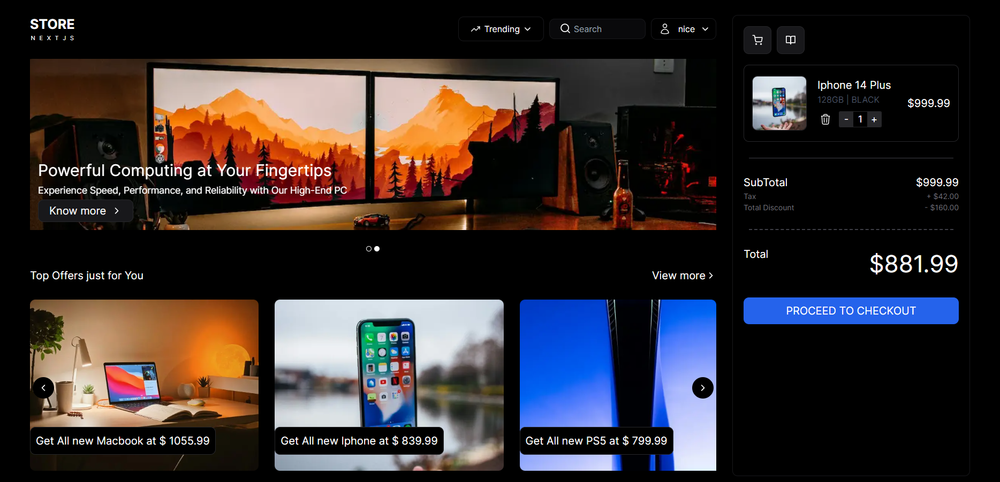

# Web Shopping App

This is a full-stack web shopping application designed to provide users with a seamless shopping experience. Leveraging modern technologies and best practices, this application offers a feature-rich environment for browsing, selecting, and purchasing products online. From user authentication to order management, every aspect is carefully crafted to ensure efficiency, security, and convenience.

## Features

- **User Authentication:** Allow users to sign up, sign in.
- **Product Listings:** Display a list of products available for purchase.
- **Product Details:** Provide detailed information about each product.
- **Shopping Cart:** Allow users to add and remove items from their shopping cart.
- **Order History:** Keep track of users' order history for future reference.

## Preview




## Technologies Used

| Technology      | Description                                                                                        |
|-----------------|----------------------------------------------------------------------------------------------------|
| React           | A JavaScript library for building user interfaces.                                                  |
| Next.js         | A React framework for building server-side rendered applications with ease.                         |
| Tailwind CSS    | A utility-first CSS framework for creating custom designs without having to leave your HTML.        |
| TypeScript      | A statically typed superset of JavaScript that compiles to plain JavaScript.                        |
| Node.js         | A JavaScript runtime built on Chrome's V8 JavaScript engine for building scalable network applications. |
| JavaScript      | A lightweight, interpreted programming language primarily used for web development.                 |
| GraphQL         | A query language for APIs and a runtime for executing those queries with your existing data.        |
| Apollo Server   | A GraphQL server that helps you build a production-ready, self-documenting GraphQL API quickly.     |
| Apollo Client   | A comprehensive state management library for JavaScript that enables you to manage both local and remote data with GraphQL. |
| MongoDB         | A NoSQL database program, using JSON-like documents with optional schemas, particularly well-suited for large-scale applications and real-time analytics. |

## Setup Instructions

1. Clone the repository:

```bash
git clone https://github.com/Bhaveshverma2077/shopping-app.git
```

2. Install dependencies for both frontend and backend:

```bash
npm run get-dependencies
```

3. Set up environment variables:
   - Create a `.env` file in  `root` directory.
   - Refer to `.env.example` files in both directories for required environment variables and their format.
   
4. Start the development servers:

   ```bash
   npm run dev
   ```

5. Access the application in your browser at `http://localhost:3000`.
